# 7-Decision-Trees-Random-Forests
1. [Tree Methods Theory and Reading](#schema1)
2. [Tree Methods Documentacion Examples](#schema2)

<hr>

<a name="schema1"></a>

## 1. Tree Methods Theory and Reading

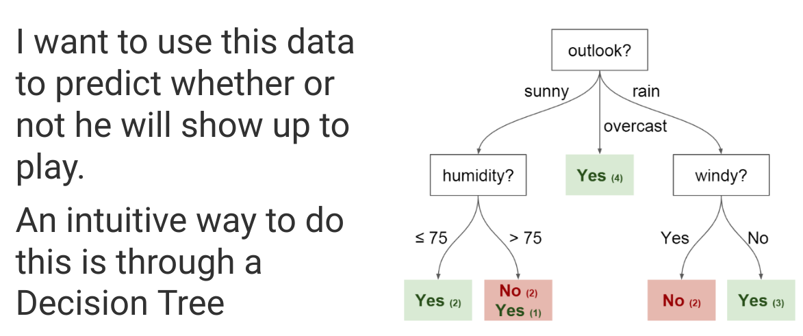

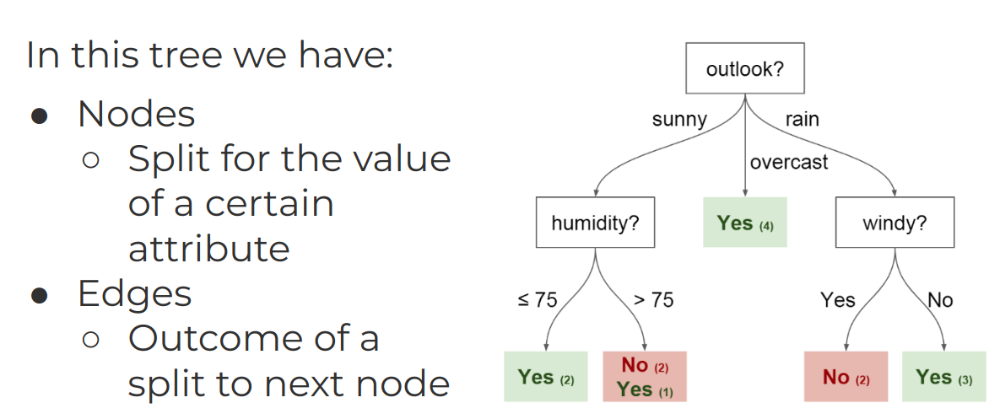

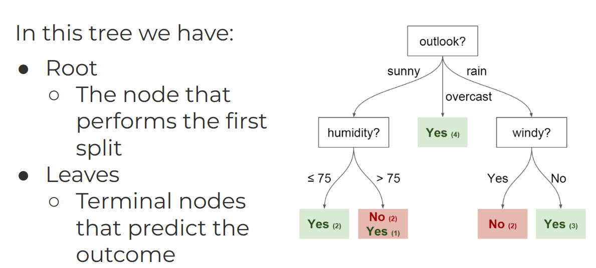

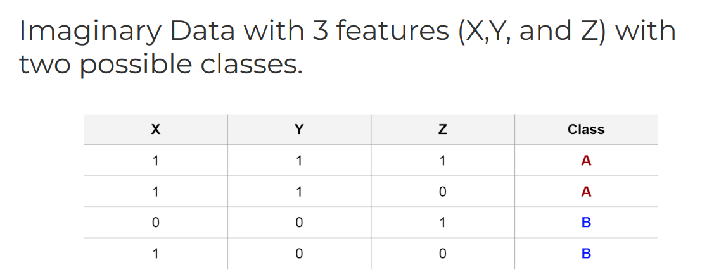

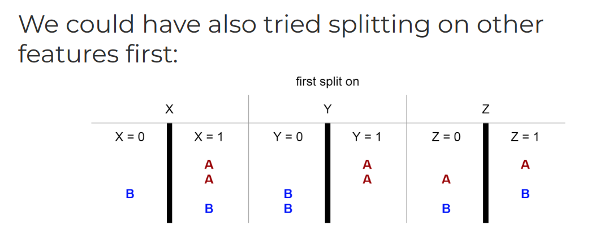

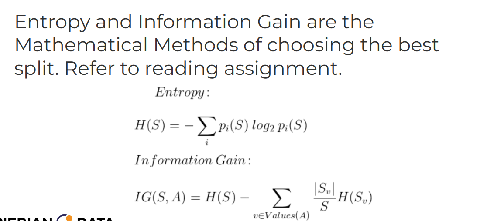

- Random Forests

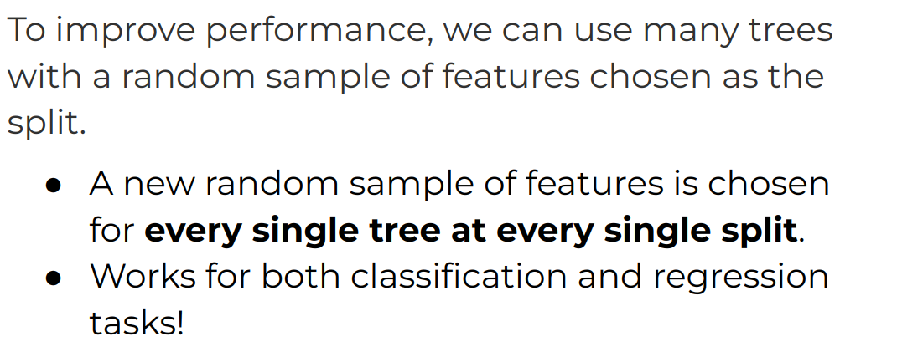


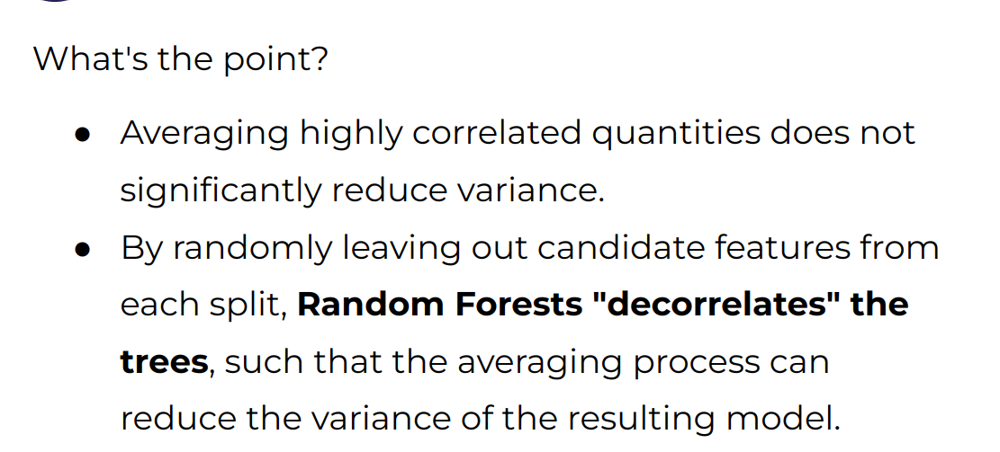

- Gradient Boosting

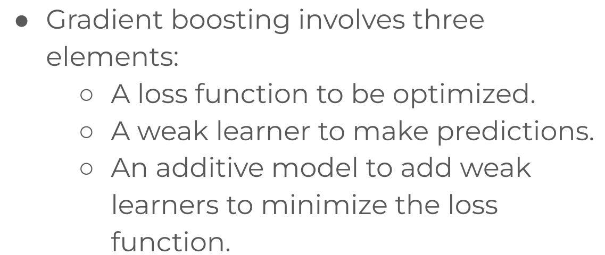


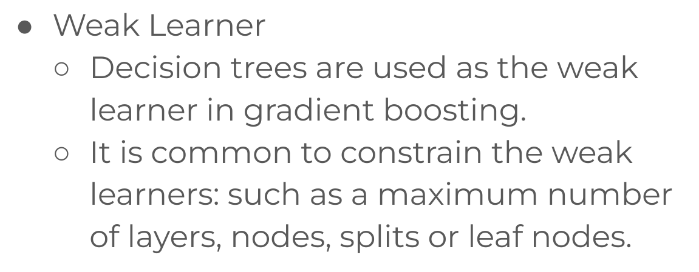
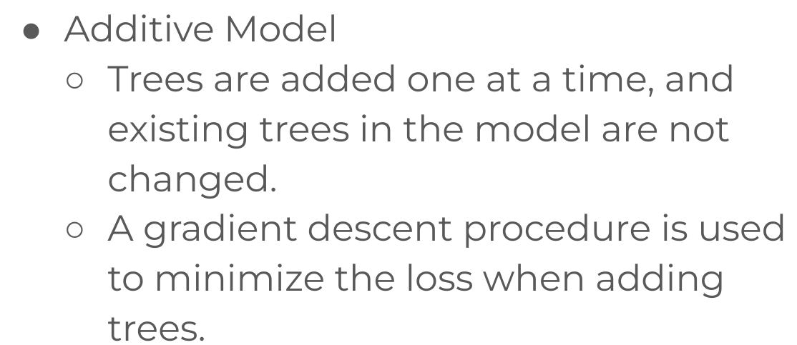

- 3 "easy" steps


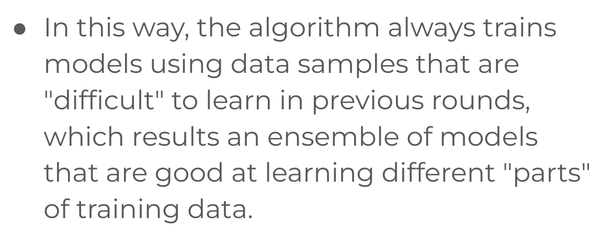


<hr>

<a name="schema2"></a>
## 2. Tree Methods Documentacion Examples

- Librerias
```
from pyspark.ml.classification import RandomForestClassifier, DecisionTreeClassifier, GBTClassifier
from pyspark.ml.evaluation import MulticlassClassificationEvaluator
```
- Cargar y parsea el archivo de datos, concertirlo a DataFrame
```
data = spark.read.format("libsvm").load("./data/sample_libsvm_data.txt")
```

- Dividir los datos en train_data y test_data (70% y 30%) 

```
train_data,test_data = data.randomSplit([0.7,0.3])
``` 

- Crear los modelos
```
dtc = DecisionTreeClassifier()
rfc = RandomForestClassifier(numTrees= 100)
gbt = GBTClassifier()
``` 
- Entrenar los modelos con los datos de entrenamiento
``` 
dtc_model = dtc.fit(train_data)
rfc_model = rfc.fit(train_data)
gbt_model = gbt.fit(train_data)
``` 
- Hacer las predicciones
```
dtc_preds = dtc_model.transform(test_data)
rfc_preds = rfc_model.transform(test_data)
gbt_preds = gbt_model.transform(test_data)
```
- Selecionar (prediction, true label) y ejecutar con test
```
acc_eval = MulticlassClassificationEvaluator(metricName="accuracy")
```
```
print('DTC ACCURACY:')
acc_eval.evaluate(dtc_preds)
0.9230769230769231

print('RFC ACCURACY:')
acc_eval.evaluate(rfc_preds)
RFC ACCURACY:

1.0

print('GBT ACCURACY:')
acc_eval.evaluate(gbt_preds)
GBT ACCURACY:

0.9230769230769231
```


